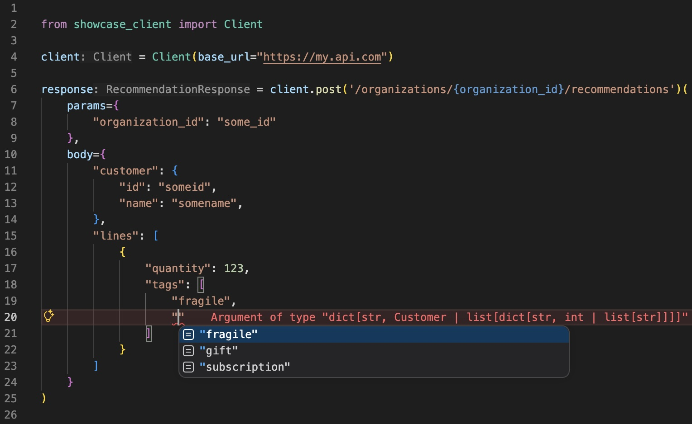

# openapi-python

`openapi-python` generates typed Python API clients from OpenAPI specs, with a developer-friendly and ergonomic string-literal-based interface strongly inspired by [openapi-typescript](https://openapi-ts.dev/).



## Installation

```bash
# If you want to define your own HTTP transport (requests, asyncio, ...)
uv add openapi-python

# For built-in httpx transport:
uv add openapi-python[httpx]
```


## Client generation

Generate a client from an OpenAPI spec in `openapi.json`:

```bash
# Types + HTTP client/transport
uv run openapi-python generate --spec ./openapi.json --out ./generated

# Just types, use your own HTTP client/transport
uv run openapi-python generate --spec ./openapi.json --out ./generated --transport-mode protocol-only
```

... or programatically:

```python
from pathlib import Path
from openapi_python import GenerationRequest, generate_client

result = generate_client(
    GenerationRequest(
        spec_source="./openapi.json",
        output_dir=Path("./generated"),
        package_name="my_client",
        overwrite=True,
    )
)
```

## Using generated clients

Generated clients expose route-specific callables with typed `params`, `query`, `headers`, `body`, and return values.

With the built-in `httpx` transport:

```python
from generated.my_client import Client

client = Client(base_url="https://api.example.com")
book = client.get("/books/{book_id}")(params={"book_id": 1})
```

For async APIs:

```python
from generated.my_client import AsyncClient

async_client = AsyncClient(base_url="https://api.example.com")
book = await async_client.get("/books/{book_id}")(params={"book_id": 1})
```

For protocol-only clients, provide your own transport:

```python
from generated.my_client import Client

client = Client(base_url="https://api.example.com", transport=my_transport)
book = client.get("/books/{book_id}")(params={"book_id": 1})
```


## Extensibility

`GeneratorExtensions` exposes two safe hooks:

- `normalize_hooks`: transform the normalized model before rendering.
- `render_context_hooks`: transform rendered file content map before writing.

## Transport Decoupling

Generated clients expose a transport protocol. You can plug in your own transport while keeping route-level typing guarantees.

Use `--transport-mode protocol-only` to generate clients that require a supplied transport and do not emit the built-in `httpx` transport classes. The default `--transport-mode default` includes `DefaultTransport` and `DefaultAsyncTransport`, which require the `httpx` extra when instantiated.

### Built-in `httpx` transport

Install the `httpx` extra and generate with the default transport mode:

```bash
uv add "openapi-python[httpx]"
uv run openapi-python generate --spec ./openapi.json --out ./generated --package my_client
```

You can supply preconfigured `httpx` clients:

```python
import httpx

from generated.my_client import AsyncClient, Client, DefaultAsyncTransport, DefaultTransport

sync_http = httpx.Client(headers={"authorization": "Bearer token"})
async_http = httpx.AsyncClient(headers={"authorization": "Bearer token"})

client = Client(
    base_url="https://api.example.com",
    transport=DefaultTransport(client=sync_http),
)
async_client = AsyncClient(
    base_url="https://api.example.com",
    transport=DefaultAsyncTransport(client=async_http),
)
```

### Custom transport

Install `openapi-python` without extras and generate protocol-only code:

```bash
uv add openapi-python requests
uv run openapi-python generate \
  --spec ./openapi.json \
  --out ./generated \
  --package my_client \
  --transport-mode protocol-only
```

Then provide an object that satisfies the generated `Transport` protocol:

```python
from collections.abc import Mapping

import requests

from generated.my_client import Client


class RequestsTransport:
    def request(
        self,
        *,
        method: str,
        route: str,
        base_url: str,
        params: Mapping[str, object] | None,
        query: Mapping[str, object] | None,
        headers: Mapping[str, object] | None,
        body: object | None,
    ) -> object:
        response = requests.request(
            method=method.upper(),
            url=f"{base_url.rstrip('/')}{route.format(**(params or {}))}",
            params={key: str(value) for key, value in (query or {}).items()} or None,
            headers={key: str(value) for key, value in (headers or {}).items()} or None,
            json=body,
        )
        response.raise_for_status()
        if response.content:
            return response.json()
        return None


client = Client(
    base_url="https://api.example.com",
    transport=RequestsTransport(),
)
book = client.get("/books/{book_id}")(params={"book_id": 1})
```

## Releases

Releases are published from the protected `releases` branch. The package version is set manually in `pyproject.toml`, and pushing a release commit to `releases` triggers the GitHub Actions release workflow. The workflow creates the matching `vX.Y.Z` tag after checks pass.

Before the first release, configure PyPI Trusted Publishing for this repository:

- PyPI project: `openapi-python`
- GitHub workflow: `release.yml`
- GitHub environment: `pypi`

The GitHub `pypi` environment should be limited to deployments from the `releases` branch.

Release steps:

```bash
# 1. Update project.version in pyproject.toml, then commit that change.
uv run python scripts/release.py --version 0.1.0

# 2. If checks pass, push the current commit to the releases branch.
uv run python scripts/release.py --version 0.1.0 --push-release-branch
```

The release workflow verifies that the version tag does not already exist, runs checks, builds the distributions, validates them with `twine`, creates the release tag, publishes to PyPI, and creates a GitHub Release with generated notes.
