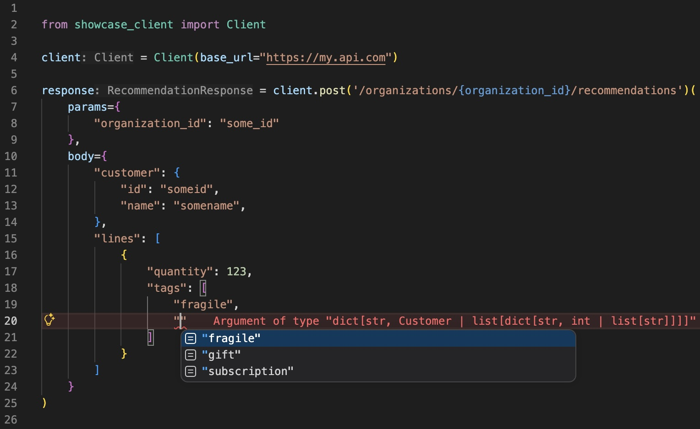

# openapi-python

[](https://github.com/Minibrams/openpylit/actions/workflows/qa.yml)
[](https://github.com/Minibrams/openpylit/actions/workflows/release.yml)
[](https://pypi.org/project/openapi-python/)

`openapi-python` generates typed Python API clients from OpenAPI specs, with a developer-friendly and ergonomic string-literal-based interface strongly inspired by [openapi-typescript](https://openapi-ts.dev/).



## Installation

```bash
uv add openapi-python[httpx]  # Ships with an `httpx` transport
uv add openapi-python         # Bring your own transport (requests, asyncio, ...)
```


## Client generation

Generate a client from an OpenAPI spec in `openapi.json`:

```bash
# Types + Protocol + HTTP transport
uv run openapi-python generate --spec ./openapi.json --out ./generated

# Types + Protocol
uv run openapi-python generate --spec ./openapi.json --out ./generated --protocol-only
```

## Using generated clients

Generated clients expose route-specific callables with typed `params`, `query`, `headers`, `body`, and return values.

When using `openapi-python[httpx]`:

```python
import httpx

from generated.my_client import AsyncClient, Client, DefaultAsyncTransport, DefaultTransport

sync_http = httpx.Client(
    base_url="https://api.example.com",
    headers={"authorization": "Bearer token"},
)
async_http = httpx.AsyncClient(
    base_url="https://api.example.com",
    headers={"authorization": "Bearer token"},
)

client = Client(
    transport=DefaultTransport(client=sync_http),
)
async_client = AsyncClient(
    transport=DefaultAsyncTransport(client=async_http),
)

book = client.get("/books/{book_id}")(params={"book_id": 1})
async_book = await async_client.get("/books/{book_id}")(params={"book_id": 1})
```

When using `openapi-python`, or for `--protocol-only` clients, provide your own transport:

```python
from generated.my_client import Client

client = Client(transport=my_transport)
book = client.get("/books/{book_id}")(params={"book_id": 1})
```

See [Custom transport](#custom-transport) on how to build a custom transport.

## Protocols

Generated clients expose a transport protocol. You can plug in your own transport while keeping route-level typing guarantees.

Use `--protocol-only` to generate clients that don't ship with a built-in transport.

Protocol typing can be relaxed independently with `--no-routes`, `--no-requests`, and `--no-responses`. 

### Custom transport

Install `openapi-python` without extras and generate protocol-only code:

```bash
uv add openapi-python requests
uv run openapi-python generate \
  --spec ./openapi.json \
  --out ./generated \
  --package my_client \
  --protocol-only
```

Then provide an object that satisfies the generated `Transport` protocol:

```python
from collections.abc import Mapping

import requests

from generated.my_client import Client


class RequestsTransport:
    def request(
        self,
        *,
        method: str,
        route: str,
        base_url: str,
        params: Mapping[str, object] | None,
        query: Mapping[str, object] | None,
        headers: Mapping[str, object] | None,
        request_media_type: str | None,
        body: object | None,
        response_media_type: str | None,
    ) -> object:
        request_kwargs = {"json": body}
        if request_media_type and request_media_type != "application/json":
            request_kwargs = {"data": body}
        response = requests.request(
            method=method.upper(),
            url=f"{base_url.rstrip('/')}{route.format(**(params or {}))}",
            params={key: str(value) for key, value in (query or {}).items()} or None,
            headers={key: str(value) for key, value in (headers or {}).items()} or None,
            **request_kwargs,
        )
        response.raise_for_status()
        if response.content:
            return response.json()
        return None


client = Client(
    transport=RequestsTransport(),
)
book = client.get("/books/{book_id}")(params={"book_id": 1})
```
